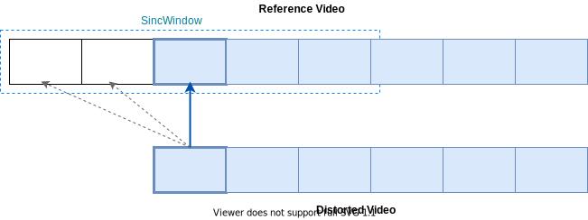

# easyVmaf

Python tool based on ffmpeg and ffprobe to deal with the video preprocesing required for VMAF inputs:
* Deinterlacing
* Upscaling/downscaling
* Frame-to-Frame Syncing
* Frame rate adaptation

Details about **How it Works** can be found [here](https://gdavila.github.io/broadcast/Vmaf/Vmaf/).

## Requirements

* `Linux`/`OSX`

* Python `>= v3.0`. Libraries: `json`, `varname`:
  
```py
pip3 install json
pip3 install python-varname
```

* FFmpeg build with `libvmaf`. More details [here](http://underpop.online.fr/f/ffmpeg/help/libvmaf.htm.gz)

## Installation

Just clone the repo and run it from the source folder.

```bash
$ git clone https://github.com/gdavila/easyVmaf.git
$ cd easyVmaf
```

## Examples

### Syncing: Reference Video delayed in regard with the first frame of Distorted one.



VMAF computation for two video samples, `reference.ts` and `distorted-A.ts`. Both videos are not synced: `reference.ts` is delayed in comparition with `distorted-A.ts`, i.e.,  the first frame of `distorted-A.ts` matchs with the frame located at 0.7007 seconds since the begining of `reference.ts` (blue arrow on the figure). To sync both videos automatically using `easyVmaf`, the next command line is used:

    ```bash
    $ python3 easyVmaf.py -d distorted-A.ts -r reference.ts -sw 2


    ...
    ...
    [Ignored outputs]
    ...
    ...

    Sync Info:
    offset:  0.7007000000000001 psnr:  48.863779
    VMAF score:  89.37913542219542
    VMAF json File Path:  distorted-A_vmaf.json
    ```

The previus command line takes a synchronisation window `sw` of *2 seconds* , this means that the sync lookup will be done between the first frame of `distorted-A.ts` (actually, in practise it takes into account several frames) and a subsample of `reference.ts` of *2 seconds* lenght since its begin.

    ```bash
    $ python3 easyVmaf.py -d distorted.ts -r reference.ts -sw 2
    ...
    ...
    [Ignored FFmpeg outputs]
    ...
    ...
    Sync Info:
    offset:  0.7007000000000001 psnr:  48.863779
    VMAF score:  89.37913542219542
    VMAF json File Path:  distorted.json
    ```

### Syncing: Distorted Video delayed in regard with the first frame of Reference one.


This time,  `distorted-B.ts` is delayed in comparition with `reference.ts`, i.e.,  The first frame of `reference.ts` matchs with the frame located at 8.3003 seconds since the begining of `distorted-B.ts`. To sync the videos automatically, the next command line is used:

    ```bash
    $ python3 easyVmaf.py -d distorted-B.ts -r reference.ts -sw 3 -ss 6 -reverse


    ...
    ...
    [Ignored FFmpeg outputs]
    ...
    ...

    Sync Info:
    offset:  8.300300000000000 psnr:  34.897866
    VMAF score:  92.34452778643345
    VMAF json File Path:  distorted-B_vmaf.json
    ```

 The previous command line applies a syncronization window `sw` of *3 seconds*,  a *sync start time* `ss` *of 6 seconds* and the `reverse` flag.  
 
Note the use of the  `reverse`  flag (that was not used on the first example). This flag allows to interchange to which video the `syncWindow` will be applied (reference or distorted).